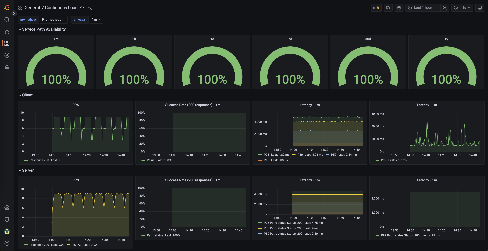

# Continuous Load



Continuous Load is a project designed to run load 24/7 across an infrastructure and monitor the network health even in production. Its goal is to find problems in infrastructure before the users of that infrastructure find them.

## What Continuous Load Tries to Solve

- Exercise full network flow to gain visibility and rely on metrics and alerts to assess the impact of a change.

- Gain Confidence when introducing change not to affect tenants on the platform. 
Become aware of issues before a tenant reports it.

- Reproduce what applications are doing on the cluster for example DNS/UDP and HTTP/GRPC/TCP flow through the main network paths like pod to pod communication through service IPs.

## Components

This project relies on: 
 - [k6](https://k6.io/) and statsd-exporter: acting as a load-injector
 - Podinfo: [golang application](https://github.com/stefanprodan/podinfo)
 - Prometheus Operator [link](https://prometheus-operator.dev/)
 - Grafana Operator [link](https://grafana-operator.github.io/grafana-operator/)
 - Helm

### Monitoring

A ServiceMonitor or PodMonitor resources are used to configure prometheus and are found in the relevant charts.

### Alerts

PrometheusRule resources are created to configure alerts on prometheus.
Such alerts follow the [Golden Signal](https://sysdig.com/blog/golden-signals-kubernetes/) principles. 

### Dashboard 

A GrafanaDashboard resource is used to create the continuous load dashboard.

## Running Locally 

To install both the prerequisites and the main chart run:
```
./deploy.sh -i
```
Note:
If there is already a deployment of the prometheus operator installed on the cluster, running this can lead to a conflict and prevent the prometheus instance from starting.  To fix this, delete one of the operator deployments e.g.
```
# find out if there are multiple operator deployments
kubectl get all --all-namespaces | grep 'prom.*operator'

# delete the unnecessary deployment
kubectl -n <namespace> delete deployment.apps/prometheus-operator
```

To install only the continuous-load components run without the flag:
```
./deploy.sh
```

### Port Forward

The dashboard can be viewed by the use of port forwarding after which it can be viewed on localhost:3000
```
kubectl -n continuous-load port-forward svc/grafana-service 3000
```

This can be done likewise with Prometheus:
```
kubectl -n continuous-load port-forward svc/prometheus-operated 9090
```

## Deployment
There are two helm charts:

Prerequsites: everything needed to display the dashboards for Continuous Load
Continuous Load: The run time components of Continuous Load

For an end to end demo, install both, for production deployments, consider integrating with an existing prometheus and grafana installation.

### Pre-configured monitoring stack (pre-requsites)

Run the following commands to deploy the monitoring stack:

```
namespace="continuous-load"

helm upgrade -install grafana-operator oci://ghcr.io/grafana-operator/helm-charts/grafana-operator \
  --namespace ${namespace} \
  --create-namespace \
  --version v5.0.0

helm dependency update ./monitoring/

helm upgrade -install --wait monitoring \
  --namespace ${namespace}  \
  ./monitoring/
```

### Continuous Load (no dashboarding)

Run the following to deploy the continuous load
```
helm dependency update ./continuous-load

helm upgrade -install --wait continuous-load \
  --namespace ${namespace}  \
  ./continuous-load/
```

### Deploying dashboards

Run the following to deploy the dashboard

```
kubectl -n ${namespace} apply -f continuous-load-dashboard.yaml
```


